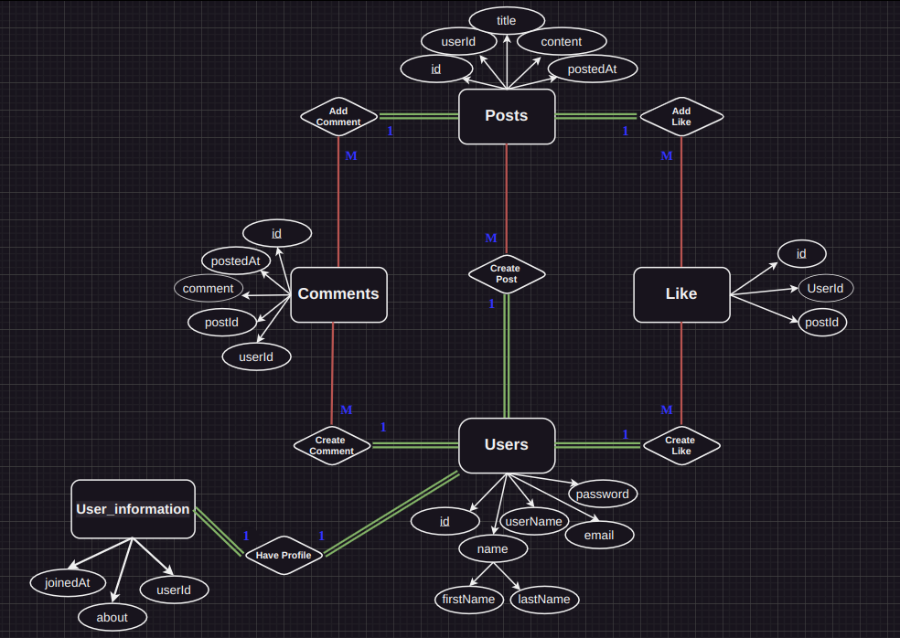

## Master Chef: Share Food Recipes

**Master Chef** is a platform dedicated to food enthusiasts where users can share, explore, and interact with food recipes. This project facilitates the creation and management of recipe posts, along with user interactions through likes and comments. It provides a seamless experience for users to engage with each other and discover new culinary inspirations

### Features

#### Posts
- **Create Posts**: Users can create new posts to share their recipes.
- **Delete Posts**: The author of the post can delete their post.
- **Markdown Support**: Users can format their posts using Markdown.

#### Likes
- **Create Likes**: Users can like any post to show appreciation.
- **Delete Likes**: Users can remove their likes from any post.
- **Real-Time Updates**: The number of likes on a post updates in real-time when the user likes or unlikes a post.
- **Like Count Display**: Each post displays the total number of likes it has received.

#### Comments
- **Create Comments**: Users can comment on any post to share their thoughts or ask questions.
- **Delete Comments**: Users can delete their own comments.
- **Real-Time Updates**: The number of comments on a post updates in real-time when the user added new comment or removed.
- **Comment Count Display**: Each post displays the total number of comments it has received.

#### User Profiles
- **Profile Page**: Each user has a profile page showcasing their information and posts.
- **User Information**: Profile pages display the user's full name, join date, and a brief biography.
- **User's Posts**: All posts created by a user are listed on their profile page.
- **Likes count**: The number of likes the user has received on his posts shows the user's popularity.
- **Interactive Elements**: Clicking on a user's name in a post or comment takes you to their profile page.

#### Security and Authentication
- **Sanitized Inputs**: Markdown scripts in posts are sanitized to **prevent SQL injections and script executions**.
- **JWT-Based Authentication**: Secure login, signup, and logout processes using JSON Web Tokens (JWT).

#### Additional User Profile Features
- **Username Display**: Concatenation of the user's first and last names.
- **Join Date Display**: The profile shows the time when the user joined the platform.
- **Biography Section**: Users can write a brief "about" section to share more about themselves.
- **Real-Time Like Updates**: When a user likes or unlikes a post, the total number of likes on their profile updates in real-time.

### Architecture

**Pattern : MVC**

**Master Chef** follows the Model-View-Controller (MVC) architectural pattern. This pattern separates the application into three main components:

1. **Model**
   - The Model represents the data and the business logic of the application. It directly manages the data, logic, and rules of the application. In Master Chef, the Model includes the database schema and interactions such as creating, reading, updating, and deleting posts, comments, likes, and user information.

2. **View**
   - The View is responsible for presenting the data to the user in a specific format. It is the user interface of the application. In Master Chef, the View includes the HTML/CSS templates and the front-end code that displays posts, comments, user profiles, and other user interactions.

3. **Controller**
   - The Controller acts as an intermediary between the Model and the View. It listens to the input from the View, processes it (using the Model), and returns the output display to the View. In Master Chef, the Controller handles user requests such as creating posts, liking a post, commenting, and managing user sessions.

By using the MVC pattern, Master Chef ensures a clean separation of concerns, making the codebase more modular, scalable, and maintainable.

**Entity Relation Diagram**

**Database Schema**

[Schema](./docs/architecture/schema.md)

**API**

[HTTP Requests (end points)](./docs/architecture/API.md)

